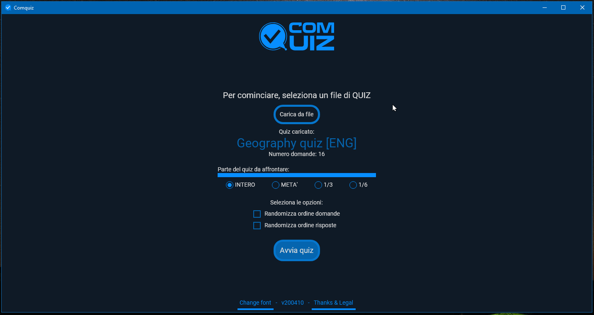

# Comquiz

**[📥 Download latest version](https://github.com/VFansss/comquiz/releases)** | [📝 Download quizzes](#download-quizzes) | [💡 Thanks & Legal](#thanks--legal)



- [Comquiz](#comquiz)
  - [Description](#description)
  - [How to use](#how-to-use)
    - [Download the software](#download-the-software)
    - [How to load quizzes](#how-to-load-quizzes)
      - [From file - Pipe format](#from-file---pipe-format)
        - [Explanation](#explanation)
        - [Example](#example)
  - [Download quizzes](#download-quizzes)
  - [Thanks & Legal](#thanks--legal)

## Description

❓ Quiz desktop application done with .NET Core, Avalonia UI and MVVM
 fbdfbv
**Noteworthy features:**

- 📁 File based.
- 🎯 Crossplatform (Available for Windows, Linux and Mac).
- 🌩 Works totally offline.
- 😇 Open Source.
- 🎰 **RANDOMIZER** (optional)
  - Randomize questions order
  - Randomize answers order and hide list annotations like: a) or a.

    Works with numbers also: 1) or 1.
- ✂️ **QUIZ SPLITTER** (optional)
  
  Split the quiz in half, 1/3 or 1/6 and face only the wanted partial
- 🌐 Localised in:

  - Eng
  - Ita

## How to use

### Download the software

Compile it yourself, or [download the latest release from HERE](https://github.com/VFansss/comquiz/releases/)

### How to load quizzes

You can load quizzes from any .txt file is a compatible format.

You can manually create a .txt file that is compatible with any of the below 'From file' format convention

#### From file - Pipe format

##### Explanation

In this format, the file will contain a series of **pipes** (this character ---> | <---) to discern `question body` and `question answers`.

A `question block` will be defined when the parsed encounter five pipes (---> ||||| <---). This will define a new "block" where the software expect to find `question body` and `question answers`. Answers can be `wrong answers` or `right answers`

- Question body

  Any text **after** two pipes. e.g.

  ```text
  || What's the capital of France?
  ```

- Wrong answer

  A pipe character and a minus character (---> |- <---)

  ```text
  |- Monaco
  ```

- Right answer

  A pipe character and a plus character (---> |+ <---)

  ```text
  |+ Paris
  ```

:exclamation: Beware of any space or special character at the start of the file! Quizzes in this format **MUSTS** start with five pipes (---> ||||| <---)

:exclamation: A `question block` is valid when it has ONE `question body` and at least ONE `right answer`.

:exclamation: If any of the above condition fail, the quiz will be considered invalid and will not load.

##### Example

```text
|||||
|| What is the capital of Myanmar?

|+a. Naypyidaw
|-b. Hồ Chí Minh
|-c. Bari
|-d. Nan-ching

|||||
|| Which of these European cities are the two most populous?

|-a. London
|+b. Moscow
|-c. Madrid
|+d. Istanbul
|-e. Berlin
|-f. Milan
|-g. Dublin
```

## Download quizzes

Do you need a quiz to face your abilities?

[Build one yourself](#how-to-load-quizzes), or check these out:

:exclamation: To download them instead on viewing them on your browser, **right click on a link -> Save as**):

- 🌄 Geography quiz [ENG] - [DOWNLOAD HERE](<https://raw.githubusercontent.com/VFansss/comquiz/master/.assets/quizzes/Geography%20quiz%20%5BENG%5D.txt>)

## Thanks & Legal

You can check my personal thanks from within the application.

To see licence of Comquiz and terms and condition of every external software, library or contribution used in the making of the software, [check the LICENCE.md file](https://github.com/VFansss/comquiz/blob/master/LICENSE.md)
